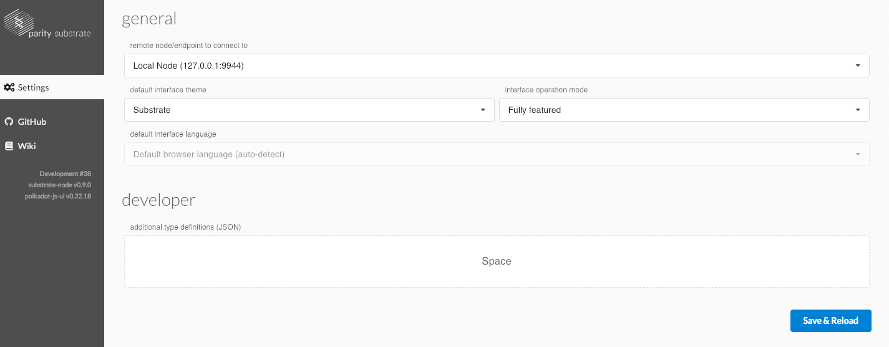
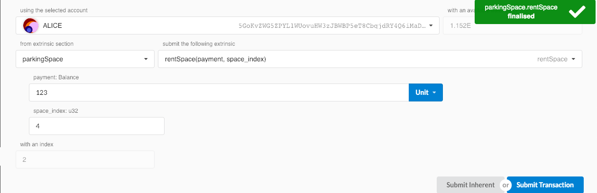
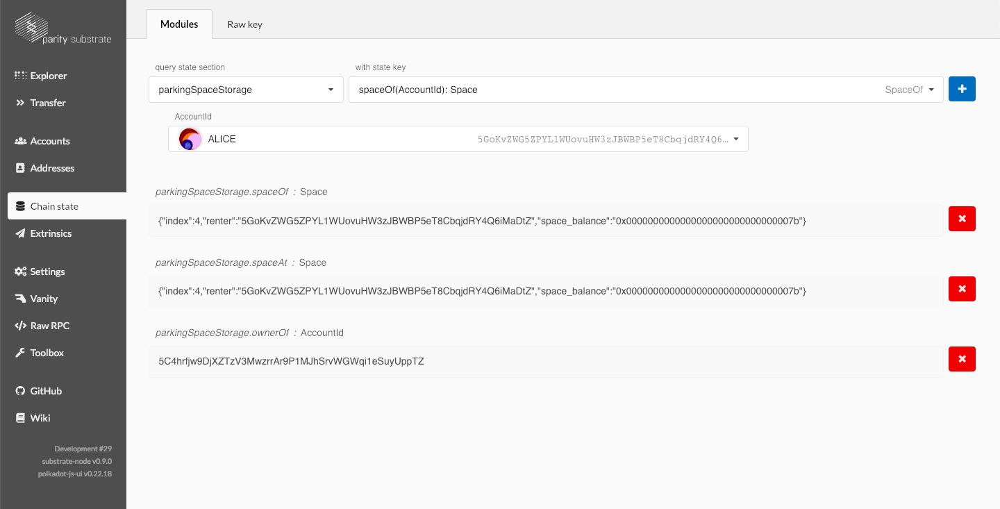

# parking-space-substrate

Parking Space Registry, silly example of using Substrate Node Template to launch a chain.

You rent a space by adding a balance to it, you can't rent spaces with a balance remaining on it.

## Build and Start parking-space chain
```
$ curl https://getsubstrate.io -sSf | bash
$ git clone https://github.com/yjkimjunior/ParkingSpaceSubstrate
$ ./init.sh
$ ./build.sh
$ cargo build --release
$ ./target/release/parking-space-substrate --dev
```

## Actually do stuff with the parking-space-chain runtime
The Polkadot/Substrate GUI makes it easier to interact with the runtime:
<https://polkadot.js.org/apps/>

Because we use a custom Struct to represent a Parking Space, we need to let the UI know about it so it can decode it appropriately. That's done with the `runtime/parking_space_struct.json` file, uploaded under the `Settings` tab in the UI.



Here you rent a space by paying some of your token balance onto it.



Here you query the chain to confirm it actually happened.

